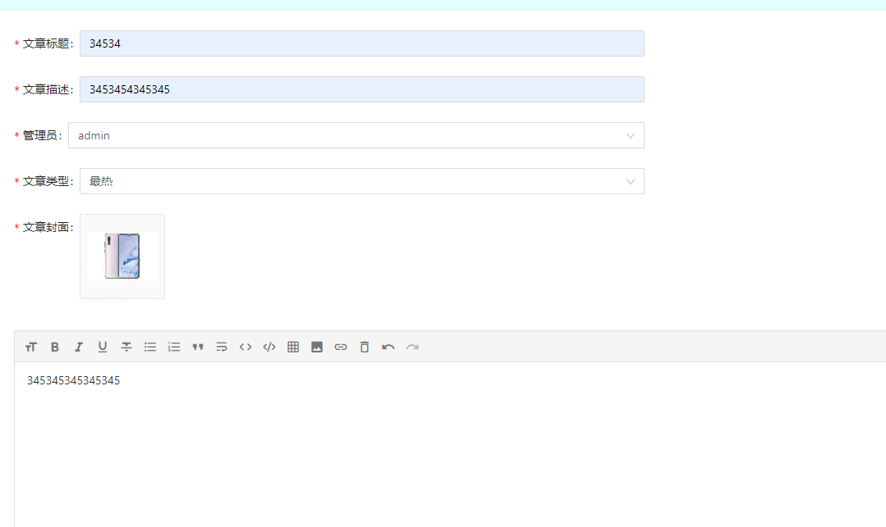
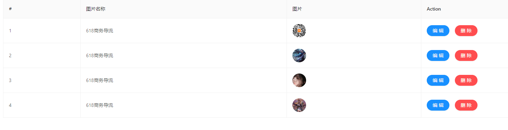
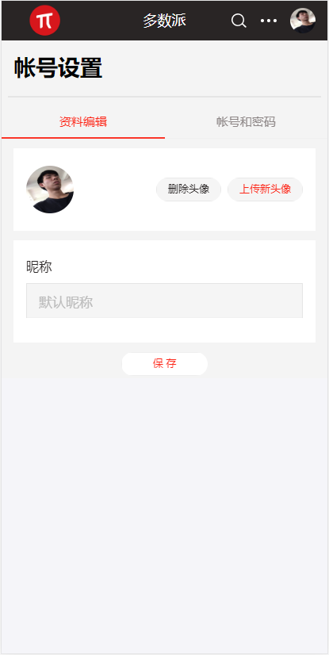

# 项目名称：多数派
* 官网地址：https://sspai.com/
* 上线网址：
* git仓库地址：https://github.com/gzh51915/Sspai
* 

## 演示

-----

## 仓库

 [多数派](https://github.com/gzh51915/Sspai "多数派仓库").

------

## 团队分工

| 分工 | 人员   | 负责模块       |
| :--- | ------ | ------------- |
| 组长 | 陈建斌 | 后台系统        |
| 组员 | 郑则濠 | 数据库，后台系统 |
| 组员 | 邝富荣 | 网站前端        |

-----

## 目录说明
- 前端
    - node_modules：项目包文件夹
    - public：公共资源
    - src：源码
        - components：组件
        - pages：页面
        - store：redux仓库
        - utils：工具文件夹

- 后端
    - src：源码
        - api: 拦截请求处理文件
        - config：接口地址配置
        - component：工具文件夹
        - page：页面

## 页面截图
- 
- 
- 
- 